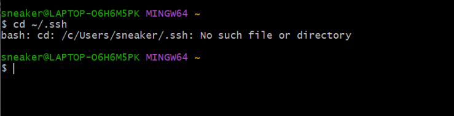
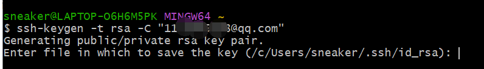
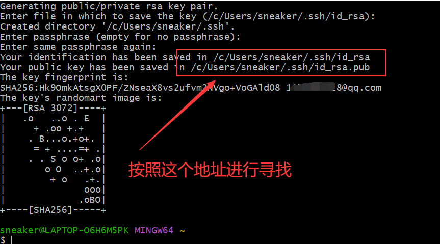
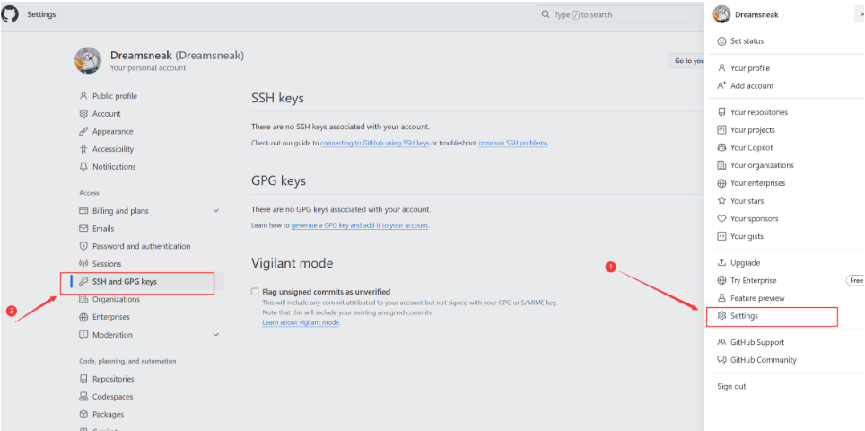
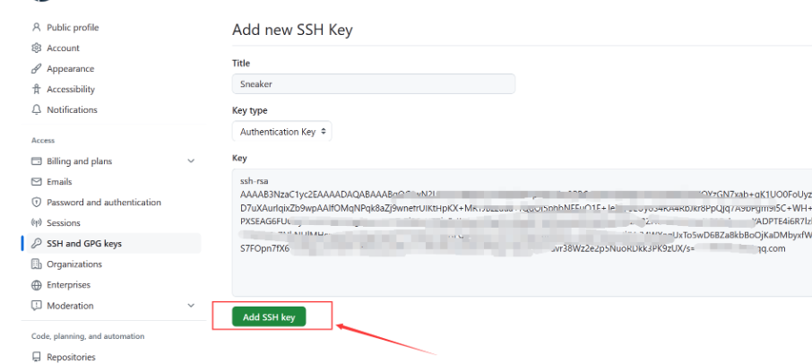
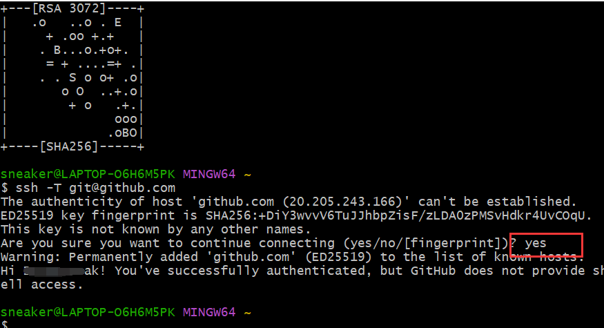
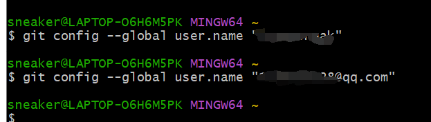
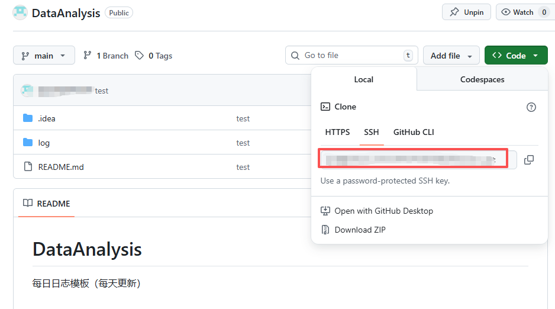
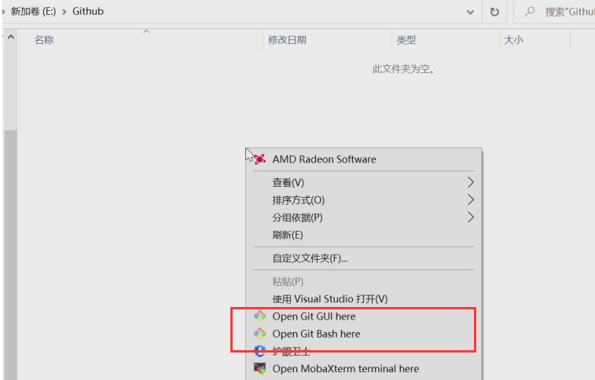
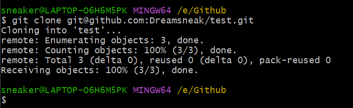

# 0409 git连接github
## 1、得到SSH
## 1.1 输入 cd ~/.ssh,返回 "no such file or directory" 表明电脑没有ssh key，需要创建ssh key；

## 1.2 故在终端输入 ssh-keygen -t rsa -C “github账号名”；

## 1.2 连续进行 3 次回车Enter（确认），得到如下截图中的信息即可； 

按路径进入 .ssh，里面存储的是两个 ssh key 的秘钥，id_rsa.pub 文件里面存储的是公钥，id_rsa 文件里存储的是私钥，不能告诉别人。打开 id_rsa.pub 文件，复制里面的内容。
## 1.3 绑定ssh密钥

## 1.4 我们回到 Git bash上边，输入：ssh -T git@github.com

## 1.5 git简单配置
将 name 最好和 GitHub 上边的一样，email 是一定要是注册 GitHub 的那个邮箱地址
这两个的顺序可以颠倒，没有固定的顺序。

git config --global user.name “gitname”
git config --global user.email “git邮箱”

## 1.6 克隆仓库
将我们的github库克隆下来到本地电脑中，方便以后进行上传代码。

接下来我们就开始选择文件存储地方了，在本地电脑中找到存储文件的地方，然后右键选择 Git Bash Here

在终端输入 git clone 地址（这个地址就是刚刚库那个Code的上代码地址）

## 1.7 git提交修改到github

git add . → 把修改「放进购物车」
git commit -m "..." → 把购物车里的东西「打包并写个标签」
git push origin main → 把这个打包好的包裹「寄到 GitHub 仓库」

