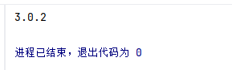

# 0415计划
1. excel数据分析（王佩芳课程一跟联）
- [ ] 未完成
2. 编写今日学习日志 log/0415.md
   - [x] 已完成
3. 阅读《利用python进行数据分析》
## 实操案例-pandas
1、安装pandas
- 在pycharm终端运行  
python -m pip install pandas -i https://pypi.tuna.tsinghua.edu.cn/simple  
- 验证是否安装  
运行“import pandas as pd print(pd.__version__)” 

  

  

 

 
